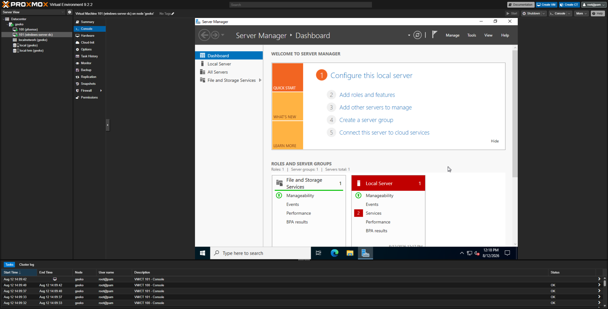
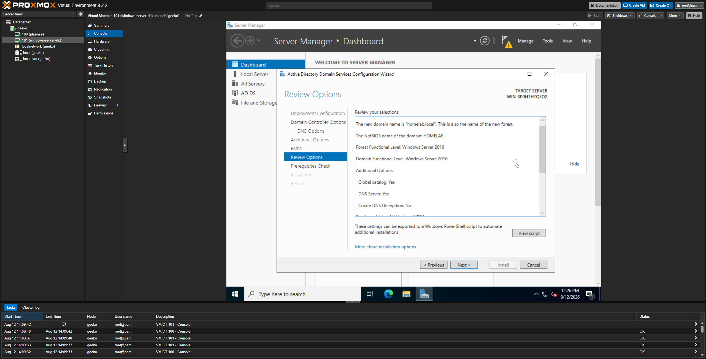
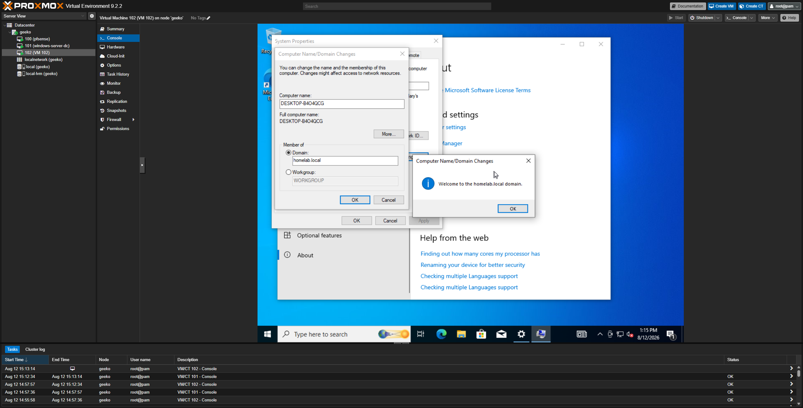
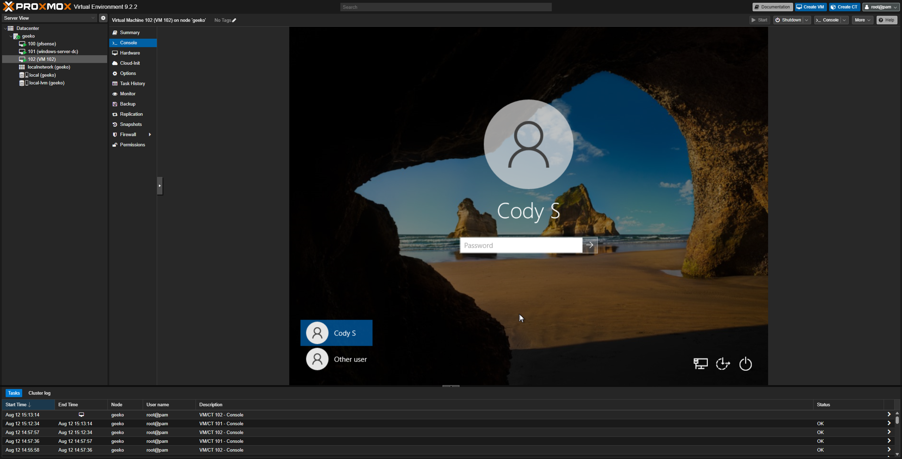
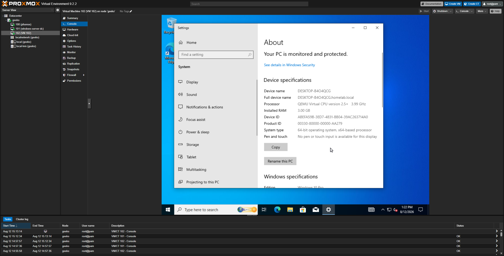

# Active Directory Lab

Setting up a Windows Server domain controller and joining a Windows 10 client, building the "corporate network" that later attack/detection projects will target.

## VM Creation: Windows Server 2022

Created a VM in Proxmox with:
- 2 cores, 4GB RAM, 80GB disk
- Network interface on 'vmbr1' (isolated internal LAN)
- Installed Windows Server 2022 Standard Evaluation (Desktop Experience)

## Installing Active Directory Domain Services

Added the AD DS role through Server Manager, then prompted the server to a domain controller - creating a new forest and domain:

- Domain name: 'homelab.local'
- NetBIOS name: 'HOMELAB'
-  Forest/Domain Functional Level: Windows Server 2016
- DNS Server: enabled (this server also handles DNS for the lab network)

## Creating Users and Groups

Built out an 'Employees' OU containing a mix of test accounts with varying password strength - intentionally including at least one weak, easily-crackable password for future attack demos, alongside stronger passwords on higher privilege accounts.

Created an 'IT-Staff' security group and added an admin-style account as a member.

## VM Creation: Windows 10 Pro Client

Created a second VM:
- 2 cores, 3GB RAM, 40GB disk
- Network interface on 'vmbr1'
- Installed Windows 10 Pro (Home Edition does not support joining domain)

Set the client's DNS server to point directly at the domain controller's IP ('10.10.10.100') rather than pfsense - required for the domain join process to correctly locate the domain via DNS.

## Problem: Domain join failed with "specified username is invalid"

Attempted to join 'homelab.local' using just 'Administrator' as the username, which Windows rejected.

### Fix

Used the fully qualified format 'HOMELAB\Administrator' instead, which Windows correctly resolved against the domain.

## Result

Successfully joined the domain and confirmed persistence by checking the device's full name under System properties, and logged in using domain credentials.

