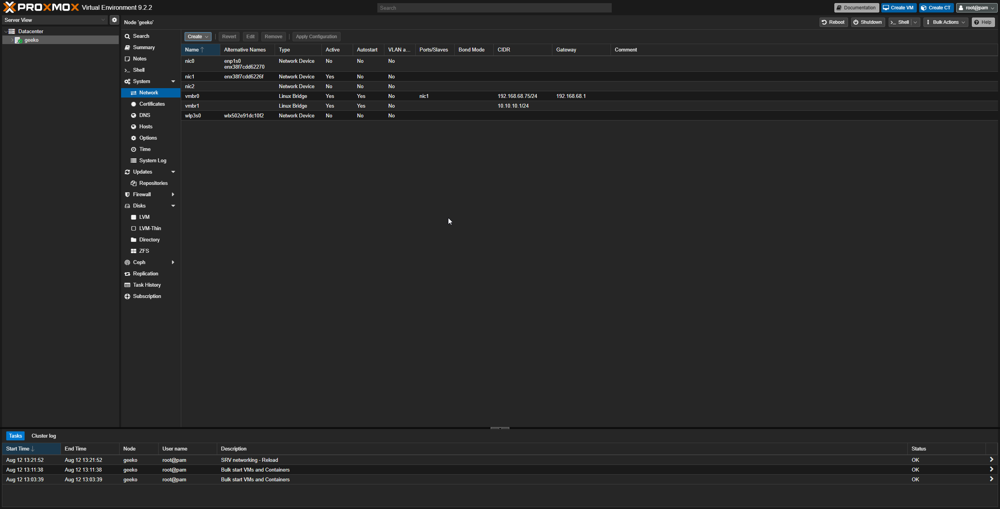
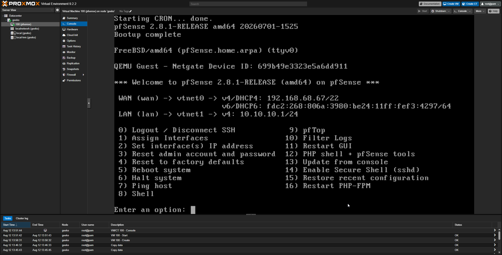

# pfsense Firewall setup

Setting up pfsense as the network gateway/firewall for my homelab, sitting between my isolated internal lab network and the outside world.

## Purpose

pfsense acts as the router and firewall between my Proxmox host's two bridges:
- 'vmbr0' - WAN, bridged to the physical NIC, gives internet access
- 'vmbr1' - LAN, isolated internal network with no physical NIC attached 

Every VM behind pfsense (AD server, future SIEM, attack/target VMs) lives on the isolated LAN side, completely separated from my home network.

## VM Creation

Created a pfsense VM in Proxmox with:
- 2 cores, 2GB RAM, 20GB disk
-Two network interfaces: one on vmbr0 (WAN), one on vmbr1 (LAN)

## Installation

Installed pfsense CE 2.8.1 via the Netgate Installer ISO. Assigned interfaces during setup:
- Wan > vtnet0
- LAN > vtnet1

Configured the LAN interface with a static IP:
- IP: '10.10.10.1/24'
- DHCP range: '10.10.10.100 - 10.10.10.199'

## Problem: IP conflict with Proxmox bridge

I had originally set an IP directly on the 'vmbr1' bridge itself ('10.10.10.1/24') when creating it in Proxmox. Once pfsense's LAN interface claimed the same address, this created a conflict - two devices holding the same IP on the network.

### Fix

Removed the IPv4/CIDR address from 'vmbr1' in Proxmox's network settings, leaving it as a plain, address-less bridge. This makes pfsense the sole gateway and IP holder on the isolated LAN, which is the correct setup.

## Result

pfsense booted successfully with WAN pulling a real DHCP address from my home network, and LAN correctly serving with the isolated '10.10.10.x' range.

