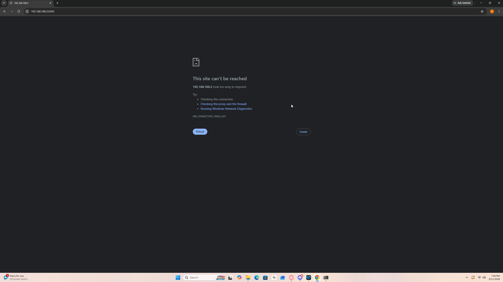
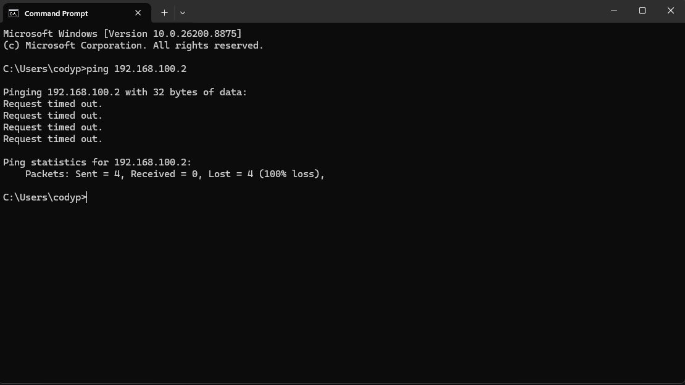
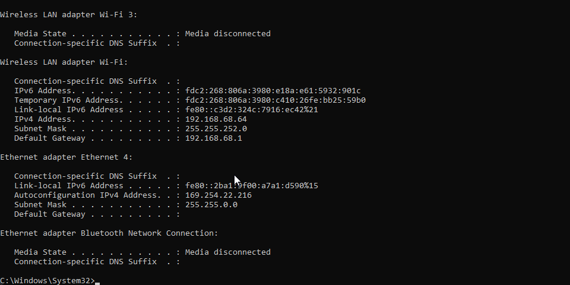
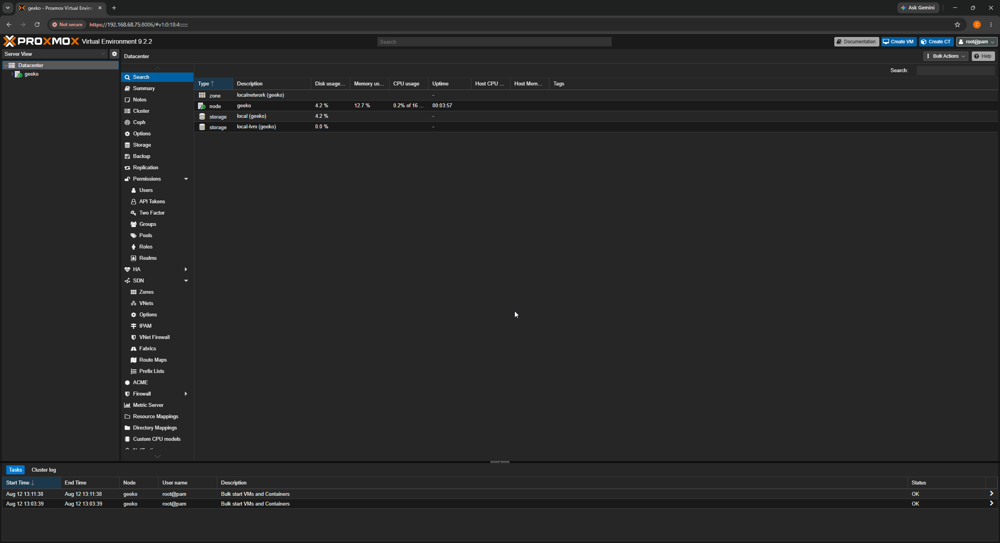

# Installing Proxmox VE on a GEEKOM A7 Max Mini PC to serve as my homelab hypervisor.

## Installation
Installed Proxmox VE 9.2.2 via bootable USB, wiped the drive, configured as a dedicated headless server.

## Problem: Web dashboard unreachable after install

Initial IP shown was '192.168.100.2'. Tried  reaching the Proxmox dashboard from my desktop's browser but got a "can't be reached" error.

Ran a ping test to confirm - got 100% packet loss, confirming the two devices were not on the same network.

### Diagnosis

Ran 'ipconfig' on my desktop and found it was on the '192.168.68.x' subnet - completely different from the '192.168.100.x' address Proxmox was showing during install.

Checked whether the mini PC was even connected to the network, it turned out Proxmox does not configure wireless network access by default. Connected an ethernet cable directly and reinstalled Proxmox.

After reinstalling and connecting the ethernet, the IP still did not show my networks actual range. Investigated further and discovered the physical ethernet cable was plugged into my AT&T modem's port rather than my Deco mesh router's LAN port. The modem was still running its own DHCP server even in passthrough mode, meaning the mini PC and my desktop were landing on two completely separate networks despite both having internet access.

### Fix

Moved the ethernet cable to the Deco's LAN port instead of the modem, and reinstalled Proxmox with a manually configured static IPv4 address matching my home network's actual subnet '192.168.68.x'.

## Result

Successfully reached the Proxmox web dashboard and logged in.

