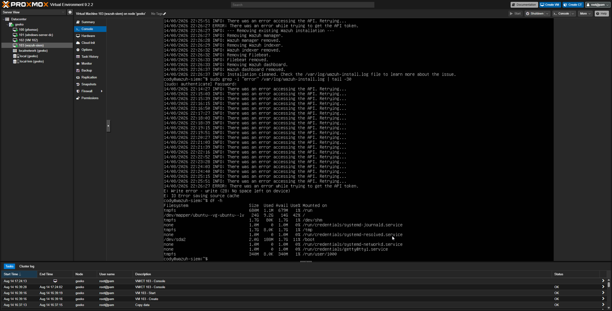
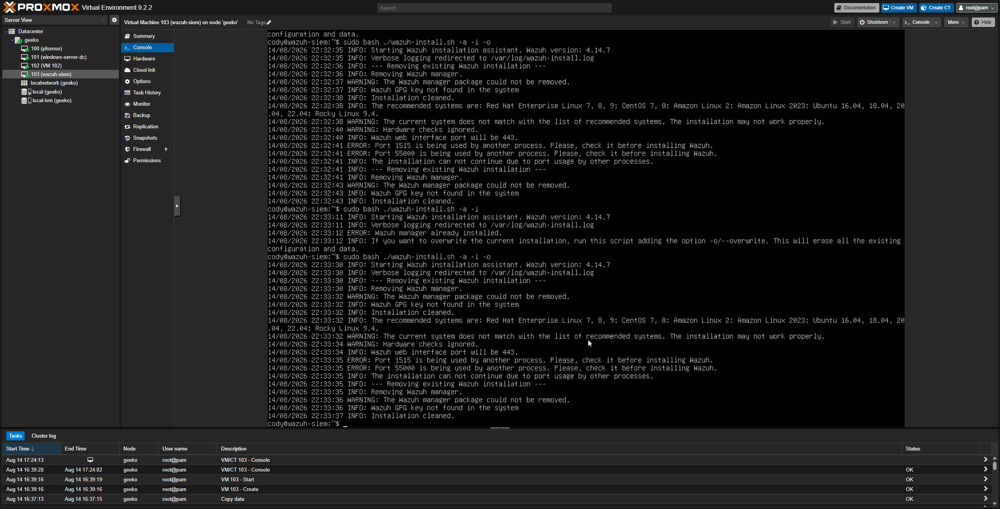
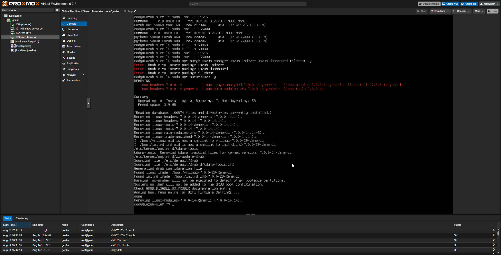
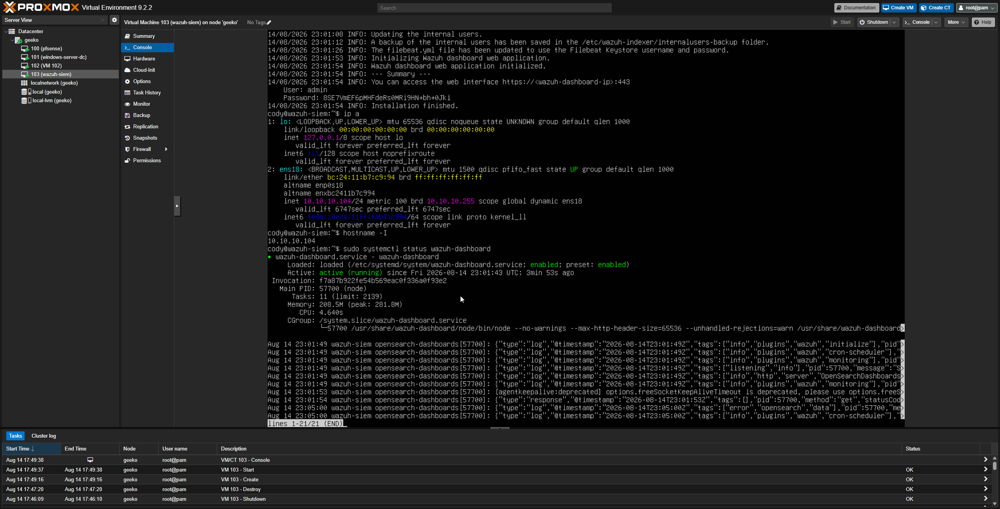
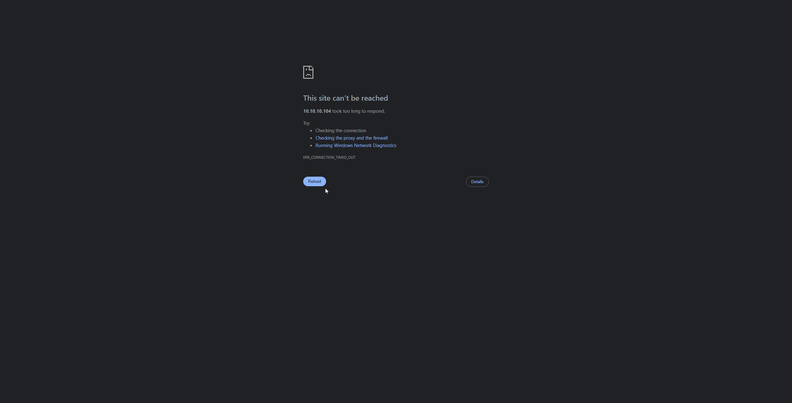
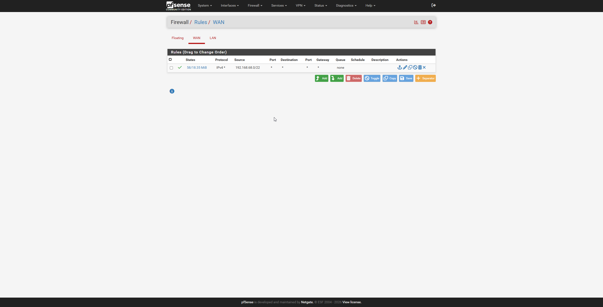
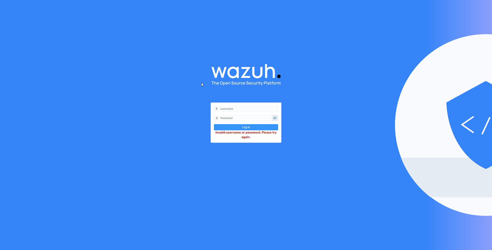
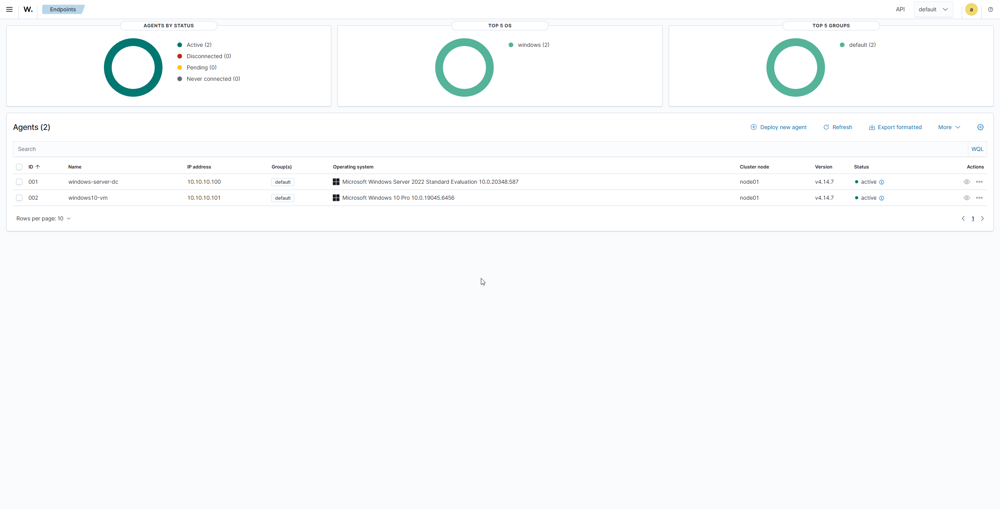

# SIEM Deployment - Wazuh

Deploying Wazuh as the SIEM for my homelab, providing centralized log collection and detection capability for the Windows Server domain controller and Windows 10 client.

## VM Creation

Created a VM in Proxmox with:
- 2 cores, 4GB RAM, 60GB disk
- Network interface on 'vmbr1' (isolated internal LAN)
- Ubuntu Server 24.04 LTS as the base OS

## Problem: Disk full during install

The Wazuh all-in-one installer failed partway through with 'No space left on device', despite allocating a 50GB disk originally to the VM.

### Diagnosis 

Checked actual filesystem usage:



Found the Ubuntu's guided LVM installer had only allocated half the disk to the root logical volume, leaving the rest as unused free space within the volume group

### Fix

Extended the logical volume to use the full disk and resized the filesystem using:

```bash
sudo lvextend -l +100%FREE /dev/ubuntu-vg/ubuntu-lv
sudo resize2fs /dev/mapper/ubuntu--vg-ubuntu--lv
```

Confirmed the fix - root filesystem now showed the full disk size.

## Problem: Leftover processes blocking reinstall

Attempting to reinstall on the same VM failed with:



Leftover processes from the earlier failed install were still holding those ports open.

### Diagnosis

Confirmed the stuck processes:

```bash
sudo lsof -i :1515
sudo lsof -i :55000
```

### Fix

Killed the stuck processes, then did a full package purge and reboot



## Problem: Corrupted package state after repeated failed installs

Even after the reboot, the next install attempt failed with '/var/ossec/bin/wazuh-keystore: No such file or directory' and the Wazuh manager failed to start. Given the VM had now been through multiple partial installs and rollbacks, decided the package state was too inconsistent to keep patching.

### Fix

Deleted the VM entirely and rebuilt it fresh with 60GB disk - this time manually verifying the LVM allocation showed the full amount before proceeding with install, rather then discovering the problem mid-install again.

## Installation

With a clean VM and correctly sized disk, ran the Wazuh installer successfully:



## Problem: Dashboard unreachable from my desktop

Could reach the Wazuh dashboard from other VMs on the isolated LAN, but not directly from my desktop browser.



### Diagnosis

Ran a ping test to pfesense's own LAN IP and other lab devices, all failed, even though these had worker before. Traced this back to resetting the pfsense admin password through the console menu, which triggered a full factory reset instead of just a password reset, wiping the WAN/LAN configuration.

Reconfigured pfsense through the setup wizard, restoring the original WAN (DHCP) and LAN (10.10.10.1/24) settings.

### Fix, part 1: WAN Firewall rule

Added a static route on my desktop pointing to pfsense's WAN address:

```bash
route add 10.10.10.0 mask 255.255.255.0 192.168.68.67 - p
```

Then added a firewall rule on pfsense's WAN interface to allow traffic from my home network through to the isolated LAN:
- Action: Pass
- Interface: WAN
- Protocol: Any
- Source: Network, 192.168.68.0/22
- Destination: Any

This allowed ping traffic through, but the dashboard still would not load in my desktop browser.



### Fix, part 2: reply-to routing

Traced the remaining issue to pfsense's default "reply-to" behavior on WAN rules, which forces return traffic back out the WAN gateway instead of routing iot normally. Disabled this under System > Advanced > Firewall & NAT, which resolved the issue completely. Confirmed with a direct port test:

```bash
Test-NetConnection -ComputerName 10.10.10.104 -Port 443
```

Successfully reached the dashboard directly from my desktop browser afterward.



## Deploying Agents

Used the Wazuh dashboard's "Deploy New Agent" wizard to generate install commands for each Windows endpoint.
- Windows Sever (domain controller)
- Windows 10 client

